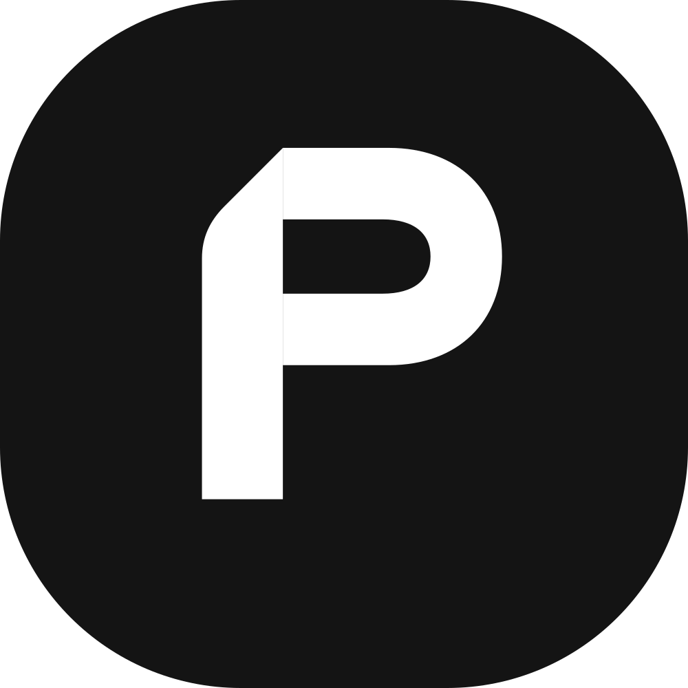
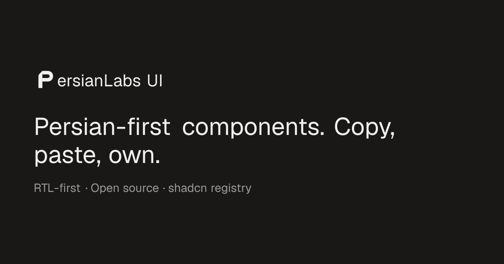

<p align="center">
  <a href="https://ui.persian-labs.ir">
    
  </a>
</p>

<h1 align="center">PersianLabs/ui</h1>

<p align="center">
  RTL-first, copy-paste components for Persian interfaces. Copy the source, own the code.
</p>

<p align="center">
  <a href="https://github.com/persianlabs/ui"></a>
  <a href="https://x.com/taymakz"></a>
  <a href="https://ui.shadcn.com/docs/registry"></a>
</p>

<p align="center">
  <a href="https://ui.persian-labs.ir/docs">Docs</a>
  ·
  <a href="https://ui.persian-labs.ir/docs/components">Components</a>
  ·
  <a href="https://ui.persian-labs.ir/llms.txt">llms.txt</a>
</p>

<p align="center">
  <a href="https://ui.persian-labs.ir"></a>
</p>

## What is PersianLabs/ui?

PersianLabs/ui is an RTL-first component registry for Persian interfaces — logical properties and mirrored icons by default, with full LTR support too. It's built on [Base UI](https://base-ui.com) and Tailwind v4, and ships as plain React source through a [shadcn-compatible registry](https://ui.shadcn.com/docs/registry), not an npm package. There's no version to chase — components land straight in your codebase, so you can read, extend, and refactor every line.

The registry currently covers **75+ components**, **10 utilities**, and **6 hooks**, split across two kinds of coverage:

- **Most of the shadcn/Base UI catalog** — Accordion, Dialog, Command, Select, Slider, Tabs, Toast, and most everything else you'd expect from a general-purpose registry, RTL-converted where it matters (directional spacing, mirrored icons, logical properties) and left untouched where it doesn't. Data Table is not shipped as an installable component yet — its docs page is a guide linking out to shadcn's own in the meantime.
- **Iranian/Persian-specific pieces you won't find upstream** — Bank Input and the Iranian Bank utility (card/Shaba validation and bank detection), City Selector (province → city), Calendar/Date Picker/Time Picker on the Jalali calendar, Toman Icon, Receipt Printer, QR Code, Mobile Number Input, and validators/formatters for National ID, Postal Code, Persian Date, Persian Holidays, Persian Slug, and Persian Reshape (fixes Persian text rendering in `next/og` OG images, which don't shape Arabic/Persian script on their own).

## Install a component

Open any component page and copy the install command.

```bash
npx shadcn@latest add @persianlabsui/city-selector
```

The full URL form works too:

```bash
npx shadcn@latest add https://ui.persian-labs.ir/r/city-selector.json
```

You can also copy the source directly from the component page.

## For AI agents

PersianLabs/ui exposes a static endpoint that coding agents can read without scraping the UI.

```txt
https://ui.persian-labs.ir/llms.txt
```

## Run locally

```bash
bun install
bun run dev
```

Open [http://localhost:3000](http://localhost:3000).

## Checks

Run these before pushing — resolve any errors and include Prettier's formatting changes in the same commit.

```bash
bun run typecheck
bun run lint
bun run format
bun run build
```

## Project structure

This is a Turborepo monorepo (bun workspaces). Every component and utility is maintained in **two parallel copies**, kept in sync by design:

| Path                                                      | What it is                                                                                                                                                                               |
| --------------------------------------------------------- | ---------------------------------------------------------------------------------------------------------------------------------------------------------------------------------------- |
| `packages/ui/src/components`, `packages/ui/src/lib`       | The internal `@workspace/ui` package — used by `apps/web` itself for the docs site's own previews and examples.                                                                          |
| `apps/web/registry/base/ui`, `apps/web/registry/base/lib` | The consumer-ready source — what `registry.json` points at, what `shadcn build` compiles into `apps/web/public/r/*.json`, and what actually ships when someone runs the install command. |
| `apps/web/registry.json`                                  | The registry manifest — source of truth for what's installable and its dependency graph.                                                                                                 |
| `apps/web/app/docs`                                       | The docs site (Next.js 16) — component pages, live previews, and the registry JSON server.                                                                                               |

## Contributing

PRs are welcome. See [CLAUDE.md](./CLAUDE.md) for the full checklist on adding or editing a registry component end-to-end (both source copies, registry entry, docs page, examples, RTL section, credits), naming conventions, and repo-specific pitfalls worth knowing before you start.
